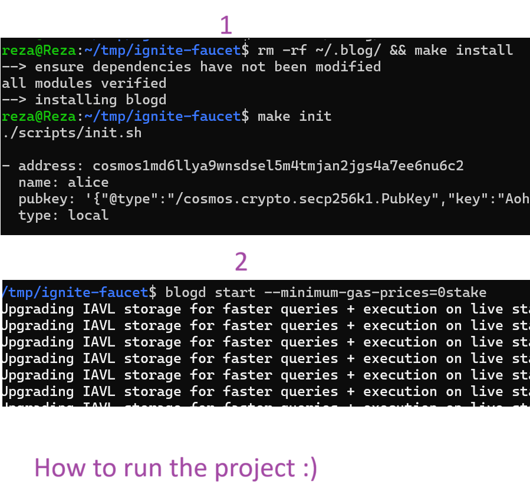
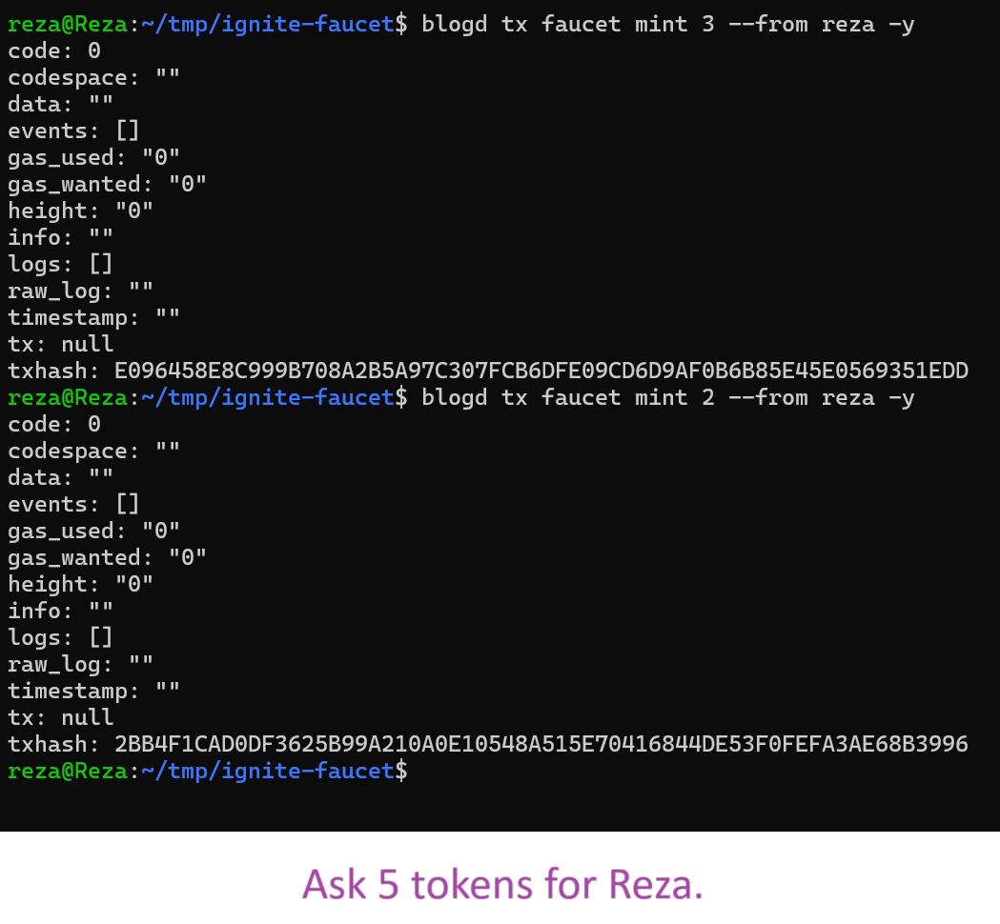
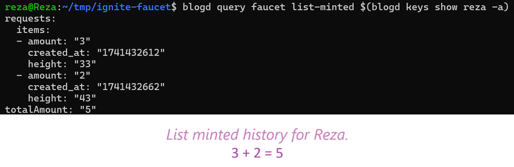
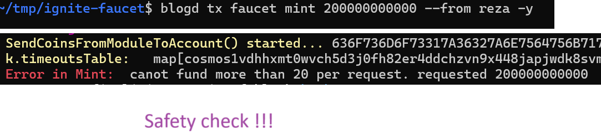
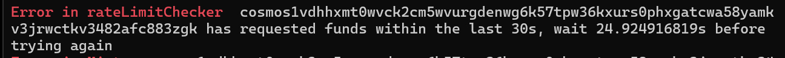

## Getting started


1. Install the chain binary with `make install`
2. Initialize the genesis files with `make init`
3. Start the chain with `blogd start --minimum-gas-prices=0stake`


### Transactions
- `blogd tx faucet mint 3 --from reza -y` Mint 3 tokens for Reza
- `blogd tx faucet mint 2 --from alice -y` Mint 2 tokens for Alice
- `blogd tx faucet mint 5 --from bob -y` Mint 5 tokens for Bob
- `blogd tx faucet -h` help


### Queries
- `blogd query faucet list-minted $(blogd keys show reza -a)` List minted for Reza
- `blogd query faucet params` Show configs


### Extra commands
- `blogd keys show reza -a` Show address of Reza
- `rm -rf ~/.blog/` - Remove the chain data


## ✅ Done
* [x] maxPerRequest check.
* [x] maxPerAddress check.
* [x] RateLimiter  check.
* [x] Enable or disable the Faucet.
* [x] Put capacity limit for the Faucet.

```go
	k.ActiveFaucet(ctx, true)
	k.SetSafeTimeout(ctx, 10*time.Second)
	k.SetFaucetMaxCapacity(ctx, math.NewInt(2000000000))
	k.SetMaxPerRequest(ctx, math.NewInt(20))
	k.SetMaxPerAddress(ctx, math.NewInt(1000))
```
## 🎬 Demo
##### How to run the project :)



##### Ask 5 tokens for Reza.


##### List minted history for Reza.


##### Safety check!



##### RateLimiter
Error in rateLimitChecker  cosmos1vdhhxmt0wvck2cm5wvurgdenwg6k57tpw36kxurs0phxgatcwa58yamkv3jrwctkv3482afc883zgk has requested funds within the last 30s, wait 24.924916819s before trying again

-------------------
## 📝 Todo List

#### Development Tasks
-   [ ] Implement unit tests with proper coverage
-   [ ] Add end-to-end (e2e) tests and use [SimApp](https://docs.cosmos.network/v0.52/learn/advanced/simulation)
-   [ ] Set up Docker or Kubernetes containerization
-   [ ] Configure GitHub Actions for CI/CD
-   [ ] Implement git hooks
-   [ ] Add comprehensive logging system ( [Telemetry](https://docs.cosmos.network/main/learn/advanced/telemetry) )
-   [ ] Implement event publishing mechanism ( [ctx.EventManager().EmitEvent](https://docs.cosmos.network/main/learn/advanced/events) )


#### Security Tasks
- [ ] Conduct a thorough security audit of the codebase
- [ ] Implement proper input validation and sanitization
- [ ] Implement proper error handling


### Run the following commands to generate proto files and lint them:

```bash
make proto-gen
make proto-lint
```
